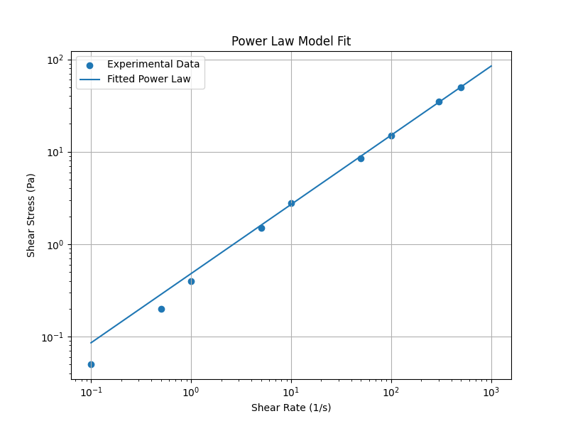
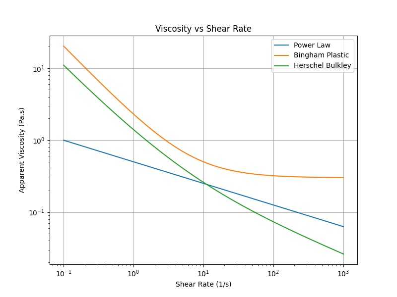
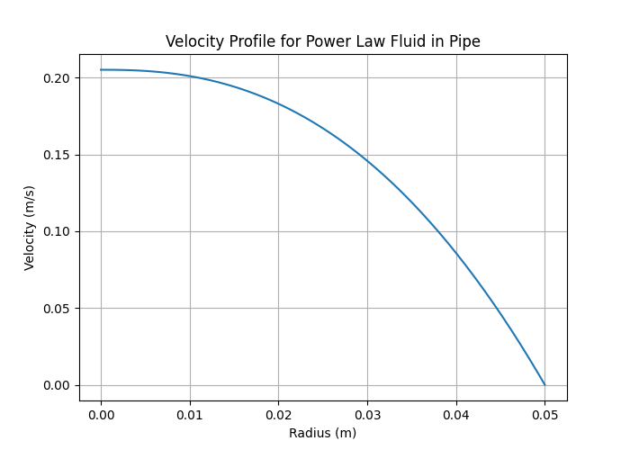

# Non-Newtonian Rheology Simulation

Python-based simulation of **non-Newtonian fluid rheology** including Power Law, Bingham Plastic, and 
Herschel–Bulkley models with visualization, viscosity analysis, pipe flow velocity profiles, and an 
interactive Dash simulator.

---

## Overview

Non-Newtonian fluids exhibit a nonlinear relationship between **shear stress** and **shear rate**, unlike 
Newtonian fluids where viscosity remains constant.

This project simulates the rheological behaviour of such fluids using Python and visualizes the results 
using scientific plotting tools and an interactive dashboard.

---

## Implemented Rheology Models

### Power Law Model

[
\tau = K \dot{\gamma}^{n}
]

* (K) → consistency index
* (n) → flow behavior index

Used to represent **shear-thinning** and **shear-thickening fluids**.

---
### Parameter Fitting Example


### Bingham Plastic Model

[
\tau = \tau_y + \mu_p \dot{\gamma}
]

* (\tau_y) → yield stress
* (\mu_p) → plastic viscosity

Represents materials that **do not flow until a yield stress is exceeded**.

---

### Herschel–Bulkley Model

[
\tau = \tau_y + K \dot{\gamma}^{n}
]

A generalized model combining **yield stress and power-law behaviour**.

---

## Project Features

* Rheology curve simulation (shear stress vs shear rate)
* Apparent viscosity analysis
* Non-Newtonian pipe flow velocity profile
* Interactive rheology simulator (Dash dashboard)
* Export of simulation data
* Visualization of results

---

## Project Structure

```
non-newtonian-rheology-simulation
│
├── main.py
├── rheology_models.py
├── visualization.py
├── pipe_flow.py
├── dashboard.py
├── results
│   ├── rheology_curve.png
│   ├── viscosity_curve.png
│   └── pipe_velocity_profile.png
└── requirements.txt
```

---

## Installation

Clone the repository:

```
git clone https://github.com/AdithyaBalakumar1/non-newtonian-rheology-simulation.git
cd non-newtonian-rheology-simulation
```

Create virtual environment:

```
python3 -m venv venv
source venv/bin/activate
```

Install dependencies:

```
pip install -r requirements.txt
```

---

## Running the Simulation

Run the rheology simulation:

```
python main.py
```

This generates:

* Rheology curves
* Viscosity curves
* Pipe velocity profile

Results are saved in the **results/** directory.

---

## Interactive Rheology Dashboard

Launch the simulator:

```
python dashboard.py
```

Open in browser:

```
http://127.0.0.1:8050/
```

The dashboard allows real-time adjustment of rheological parameters.

---

## Applications

* Chemical engineering rheology analysis
* Computational fluid mechanics studies
* Educational demonstrations of non-Newtonian fluids
* Scientific visualization of rheological models

---

## Future Improvements

* 2D velocity field visualization
* CFD-based non-Newtonian flow solver
* Experimental data fitting
* GUI-based rheology simulator

---

## Author

Adithya Balakumar

GitHub:
https://github.com/AdithyaBalakumar1

=======
# non-newtonian-rheology-simulation
Python-based simulation of non-Newtonian fluid rheology including Power Law, Bingham Plastic, and Herschel–Bulkley models with visualization, viscosity analysis, pipe flow velocity profiles, and an interactive Dash simulator.
>>>>>>> 7911ad5f683a0272bf165b6ef7cfb999e2855e9b

## Simulation Results

### Rheology Curve
Shear stress vs shear rate for different non-Newtonian models.


---

### Viscosity Curve
Apparent viscosity variation with shear rate.



---

### Pipe Flow Velocity Profile
Velocity distribution for a power-law fluid in laminar pipe flow.


