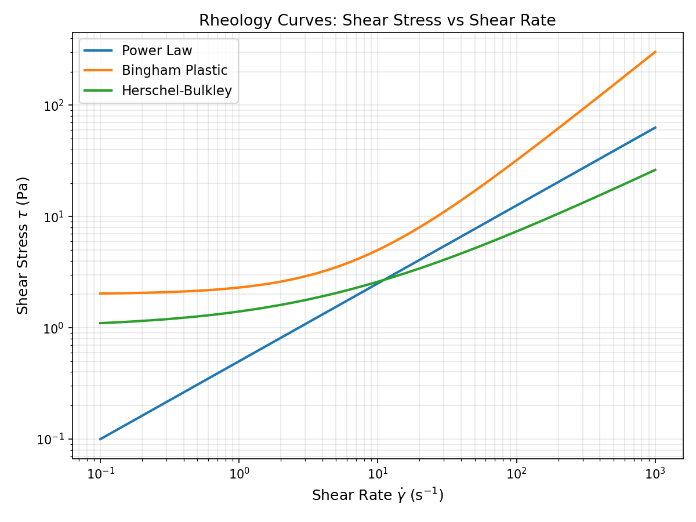
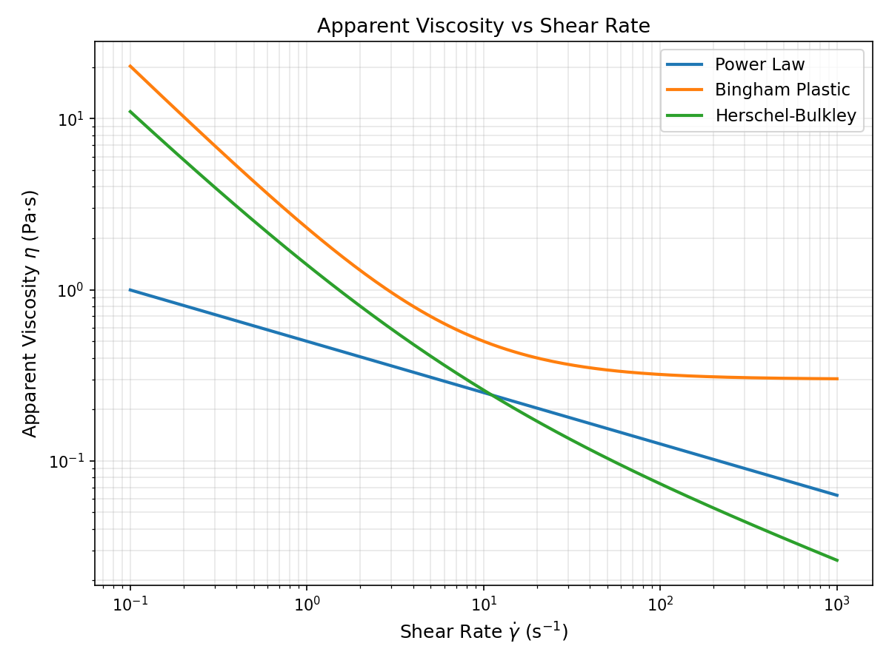
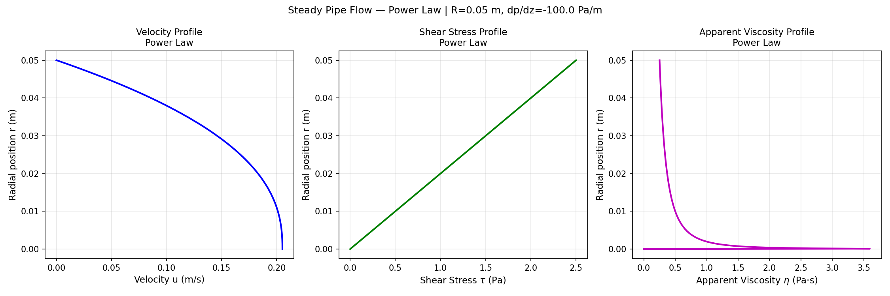
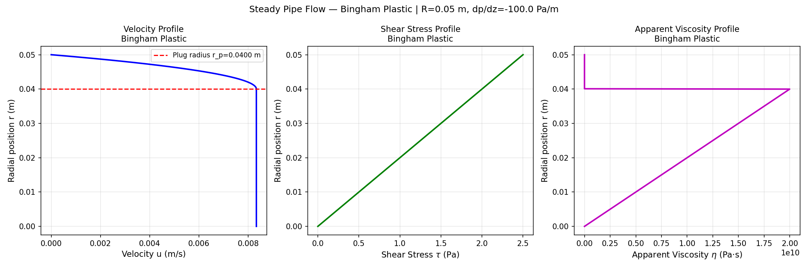
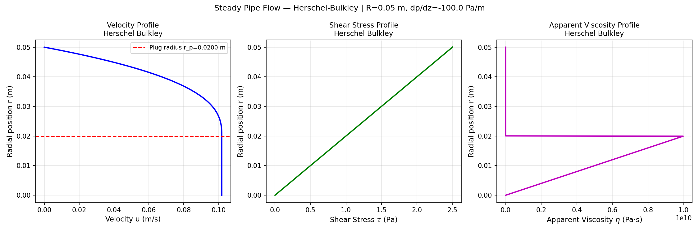
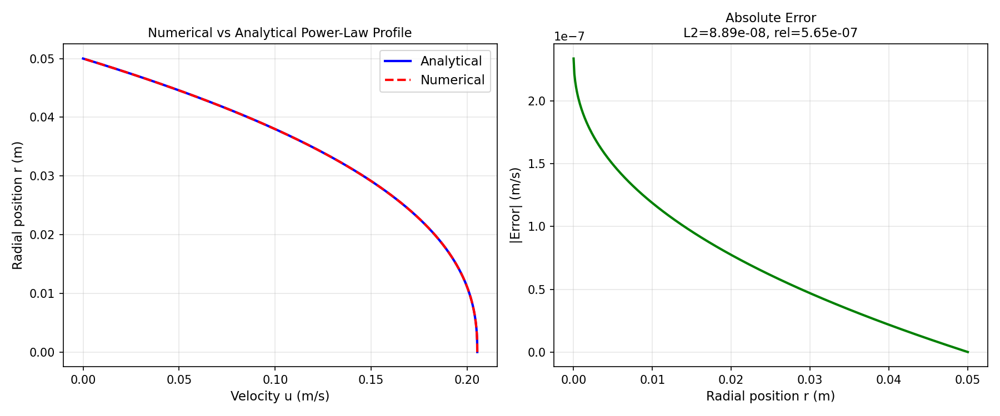
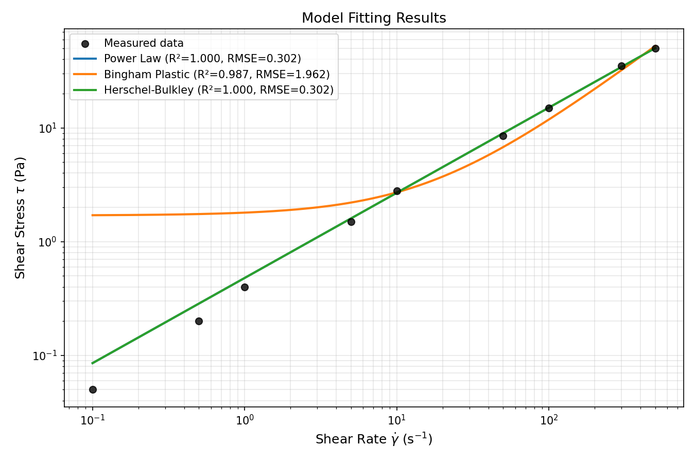

# Non-Newtonian Rheology Simulation Report

**Run ID:** `20260319_174415`  
**Generated:** 2026-03-19 17:44:15

---

## Rheology Models

### Power Law
- **params**: {'K': 0.5, 'n': 0.7}

### Bingham Plastic
- **params**: {'tau_y': 2.0, 'mu_p': 0.3}

### Herschel-Bulkley
- **params**: {'tau_y': 1.0, 'K': 0.4, 'n': 0.6}

## Steady Pipe Flow Results

### Power Law
- **Wall shear stress τ_w**: 2.5000 Pa
- **Volumetric flow rate Q**: 8.837372e-04 m³/s
- **Average velocity V**: 0.112521 m/s
- **Generalized Reynolds number Re_g**: 40.52

### Bingham Plastic
- **Wall shear stress τ_w**: 2.5000 Pa
- **Volumetric flow rate Q**: 5.715972e-05 m³/s
- **Average velocity V**: 0.007278 m/s
- **Plug radius r_p**: 0.040000 m

### Herschel-Bulkley
- **Wall shear stress τ_w**: 2.5000 Pa
- **Volumetric flow rate Q**: 5.716731e-04 m³/s
- **Average velocity V**: 0.072788 m/s
- **Plug radius r_p**: 0.020000 m

## Parameter Fitting Results

### Power Law
- **K**: 0.478809
- **n**: 0.749100
- **RMSE**: 0.302459
- **R²**: 0.999684
- **AIC**: 8.0163
- **BIC**: 8.4108

### Bingham Plastic
- **tau_y**: 1.694997
- **mu_p**: 0.101588
- **RMSE**: 1.962253
- **R²**: 0.986684
- **AIC**: 41.6746
- **BIC**: 42.0690

### Herschel-Bulkley
- **tau_y**: 0.000000
- **K**: 0.478809
- **n**: 0.749100
- **RMSE**: 0.302459
- **R²**: 0.999684
- **AIC**: 10.0163
- **BIC**: 10.6080

## Plots

